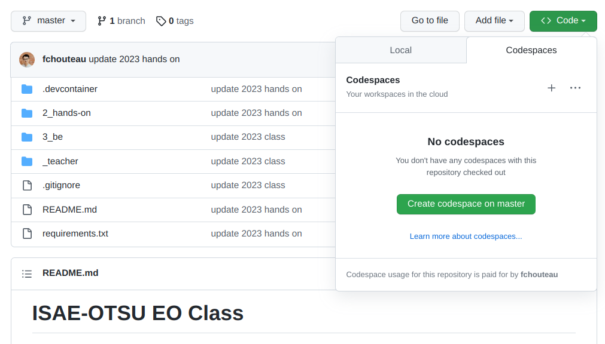
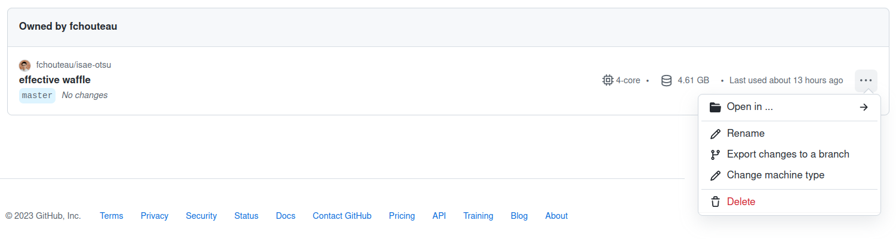

# ISAE-OTSU EO Class

## Cours + TP

### Cours

[Slides](https://docs.google.com/presentation/d/1N54HRcXiMXJWksFLkt6moXJtLa8SI8SOkpHuEMJlVcY/edit?usp=sharing)

### Mise en place

Nous allons utiliser [github codespaces](https://github.com/features/codespaces) pour ce TP

- Lisez la documentation pour comprendre ce qu'est le Codespace
- Créez un compte github
- Lancez un codespace depuis ce repository
- Vous devriez voir apparaître un visual studio code dans votre navigateur web
- Attendez la fin de l'installation
- Lancez la commande `export LOCALTILESERVER_CLIENT_PREFIX='proxy/{port}'` dans un terminal
- Lancez `jupyter lab` dans un terminal, puis copiez le token qui s'affiche
- Ouvrez le jupyterlab en vous rendant dans "ports" puis en copiant l'URL donnée
- Allez dans `2_hands_on` et parcourez les notebooks

## BE 

Il est conseillé de changer le type de machine pour prendre une machine à 4 CPU

### Introduction à dask, xarray

Pour avoir plus d'informations sur dask, voici le [slidedeck d'introduction](https://docs.google.com/presentation/d/e/2PACX-1vSTH2kAR0DCR0nw8pFBe5kuYbOk3inZ9cQfZbzOIRjyzQoVaOoMfI2JONGBz-qsvG_P6g050ddHxSXT/pub?start=false&loop=false&delayms=60000#slide=id.p)

Effectuez les notebooks suivants dans l'ordre:

Notebooks d'introduction à Dask
- 00_overview.ipynb
- 01_array.ipynb
- 02_dask.delayed.ipynb 
- 03_distributed.ipynb 
- 04_futures.ipynb 

Notebook d'application au traitement d'images
- 05_image_processing.ipynb

Notebook d'exercice:
- 06_cloud_detector.ipynb

Si cela vous intéresse, le site de Dask donne accès à de nombreux guides supplémentaires, notamment [ce tutorial](https://tutorial.dask.org/) qui parcours les fonctionnalités offertes par dask à la fois en traitement de données mais aussi en apprentissage automatique.
